# Assistant Brain OS 🧠

A modular multi-agent system designed to act as your "Second Brain." It listens for input via Telegram (voice and text), intelligently routes requests to specialized AI agents, and processes tasks asynchronously while building a searchable knowledge base with Obsidian-style features.

## ✨ Latest Features (v4.0)

### 📓 Journal Agent (NEW)
- **Voice & text journaling** via Telegram
- **Auto-linking** to knowledge graph and related notes
- **Mood detection** (positive/negative/neutral)
- **Topic extraction** (keyword-based, zero LLM)
- **Cross-linking** to existing knowledge entries
- **Voice journal mode** — all voice messages auto-routed to journal
- Fully deterministic — zero LLM calls

### ✅ Task Manager (NEW)
- **Natural language date parsing** ("remind me tomorrow", "by next Friday")
- **Priority detection** (urgent/high/medium/low)
- **Recurring reminders** with scheduler (checks every 15 min)
- **Task CRUD** — add, list, complete, delete
- **Auto-linking** tasks to related knowledge
- Deterministic — zero LLM calls

### 🎥 YouTube Video Intelligence
- **Automatic transcript extraction** (free, no API key needed)
- **Smart summarization** with AI (TL;DR, key points, concepts, quotes)
- **Chapter detection** with clickable timestamps
- **Full-text search** of video content
- Works with 90%+ of videos that have captions
- Cost: $0.01-0.02 per video (LLM summary only)

### 📚 Obsidian-Style Knowledge Graph
- **Bidirectional links**: `[[Note Title]]` creates two-way connections
- **Backlinks view**: See all notes that reference a concept
- **Tag hierarchy**: `#ai/ml/nlp` creates parent-child relationships
- **Daily notes**: Temporal organization (YYYY-MM-DD)
- **NetworkX graph**: Visualize knowledge connections
- **Auto-linking**: Notes automatically connect to daily notes and related concepts

### 🔍 Advanced Retrieval System
- **Hybrid search**: BM25 keyword + semantic vector search
- **Contextual retrieval**: Anthropic's approach for better understanding
- **Metadata filtering**: Search by tags, date, content type
- **Ranked results**: Weighted combination of search methods
- **Backlink traversal**: Follow knowledge connections

### 🚁 Self-Healing Rescue System
- **AI-powered failure recovery**: Tasks auto-fix when they fail
- **Intelligent diagnosis**: LLM analyzes root causes
- **Auto-recovery**: High-confidence fixes applied automatically
- **PR-ready issues**: Detailed bug reports for developers
- **Inspired by Temporal**: Durable execution with AI enhancement
- **5 recovery strategies**: Retry, re-route, patch, skip, or escalate

---

## 📋 Table of Contents

- [Architecture](#architecture)
- [System Components](#system-components)
- [Data Flow](#data-flow)
- [User Experience Features](#user-experience-features)
- [Testing](#testing)
- [Security](#security)
- [Setup & Installation](#setup--installation)
- [How It Works](#how-it-works)
- [Agent System](#agent-system)
- [Troubleshooting](#troubleshooting)
- [Possible Improvements](#possible-improvements)
- [Documentation](#documentation)

---

## 🏗️ Architecture

### High-Level System Architecture

```mermaid
graph TB
    subgraph "User Interface"
        TG[Telegram Bot]
        TGU[Telegram User]
        VJBOT[Voice Journal Bot<br/>Telegram Voice]
    end

    subgraph "Web Interface"
        WEB[Web Dashboard<br/>React + FastAPI]
    end

    subgraph "Orchestration Layer"
        MAIN[main.py<br/>Deterministic Router & URL Detection]
    end

    subgraph "Queue System"
        REDIS[(Redis Queue<br/>& Cache)]
    end

    subgraph "Worker Layer"
        W1[Worker 1<br/>worker.py<br/>+ Rescue Dispatch]
        W2[Worker 2<br/>worker.py<br/>+ Rescue Dispatch]
    end

    subgraph "Agent System"
        CSAVER[💾 Content Saver<br/>YouTube/Web/Tweets]
        ARCH[📚 Archivist<br/>Hybrid Search & Backlinks]
        RES[🔬 Researcher<br/>Web Research]
        WRI[✍️ Writer<br/>Content Creation]
        JRNL[📓 Journal<br/>Voice/Text Diary]
        TASK[✅ Task Manager<br/>Reminders & Todos]
        COD[💻 Coder<br/>Code Generation]
        RESCUE[🚁 Rescue Agent<br/>AI Self-Healing]
    end

    subgraph "Knowledge Graph Layer"
        KG[NetworkX Graph<br/>Bidirectional Links<br/>Tag Hierarchy<br/>Daily Notes]
    end

    subgraph "Storage Layer"
        SQLITE[(SQLite<br/>Metadata & Relations)]
        CHROMA[(ChromaDB<br/>Vector Embeddings<br/>Hybrid Search)]
    end

    subgraph "External Services"
        DEEPSEEK[DeepSeek API<br/>LLM & Summaries]
        OPENAI[OpenAI API<br/>Whisper STT & Embeddings]
        TAVILY[Tavily API<br/>AI Research]
        DDG[DuckDuckGo<br/>Free Search]
        YT[YouTube APIs<br/>Transcripts & Metadata]
        PLAYWRIGHT[Playwright<br/>Web Scraping]
    end

    TGU -->|Text/Voice/URLs| TG
    TG -->|Receive Message| MAIN
    VJBOT -->|Voice Messages| MAIN
    WEB -->|HTTP Request| REDIS
    MAIN -->|Voice| OPENAI
    MAIN -->|Deterministic Routing| REDIS

    REDIS -->|Pop Job| W1
    REDIS -->|Pop Job| W2

    W1 -->|Execute| CSAVER
    W1 -->|Execute| ARCH
    W1 -->|Execute| RES
    W1 -->|Execute| WRI
    W1 -->|Execute| JRNL
    W1 -->|Execute| TASK
    W1 -->|Execute| COD
    W1 -->|On Failure| RESCUE

    W2 -->|Execute| CSAVER
    W2 -->|Execute| ARCH
    W2 -->|Execute| RES
    W2 -->|Execute| WRI
    W2 -->|Execute| JRNL
    W2 -->|Execute| TASK
    W2 -->|Execute| COD
    W2 -->|On Failure| RESCUE

    CSAVER -->|Extract| YT
    CSAVER -->|Scrape| PLAYWRIGHT
    CSAVER -->|Save| KG
    CSAVER -->|Summarize| DEEPSEEK

    ARCH -->|Hybrid Search| CHROMA
    ARCH -->|Get Backlinks| KG
    ARCH -->|Query| SQLITE

    JRNL -->|Save Entry| SQLITE
    JRNL -->|Embed| CHROMA
    JRNL -->|Cross-Link| KG

    TASK -->|CRUD| SQLITE

    RES -->|Search| TAVILY
    RES -->|Search| DDG
    RES -->|Scrape| PLAYWRIGHT
    RES -->|Synthesize| DEEPSEEK

    WRI -->|Generate| DEEPSEEK
    WRI -->|Context| CHROMA

    COD -->|Generate| DEEPSEEK

    RESCUE -->|Diagnose| DEEPSEEK
    RESCUE -->|Requeue| REDIS

    KG -->|Store| SQLITE
    KG -->|Embed| CHROMA

    CHROMA -->|Embeddings| OPENAI

    W1 -->|Success| TG
    W1 -->|Success| WEB
    W2 -->|Success| TG
    W2 -->|Success| WEB
    TG -->|Response| TGU

    style MAIN fill:#4CAF50
    style W1 fill:#2196F3
    style W2 fill:#2196F3
    style CSAVER fill:#FF9800
    style ARCH fill:#FF9800
    style RES fill:#FF9800
    style WRI fill:#FF9800
    style JRNL fill:#FF9800
    style TASK fill:#FF9800
    style COD fill:#FF9800
    style RESCUE fill:#E91E63
    style KG fill:#9C27B0
    style REDIS fill:#F44336
    style SQLITE fill:#9C27B0
    style CHROMA fill:#9C27B0
    style WEB fill:#00BCD4
    style VJBOT fill:#8BC34A
```



### Process Management Architecture


---

## 🔧 Technology Stack

### Core Framework
- **Python 3.12+** - Primary language
- **PydanticAI** - Agent framework with tool support
- **python-telegram-bot** - Telegram integration
- **AsyncIO** - Asynchronous execution

### AI & LLM Services
- **DeepSeek API** - Primary LLM provider (cost-effective)
  - Agent reasoning & synthesis
  - Query analysis & breakdown
  - Natural conversation
- **OpenAI API** - Voice transcription only
  - Whisper STT for voice messages

### Research APIs (Multi-Source)
- **Tavily** - AI-optimized research (primary)
  - $0.002 per search
  - 1000 free searches/month
  - AI-generated summaries + sources
- **DuckDuckGo** - Free web search (secondary)
  - Unlimited searches
  - Privacy-focused
  - Good general coverage
- **Brave Search** - Optional third source
  - 2000 free searches/month
  - Comprehensive results

### Data Storage
- **ChromaDB** - Vector database
  - Semantic search with embeddings
  - Hybrid search (BM25 + semantic)
  - Contextual retrieval
  - Search result caching
- **SQLite** - Relational database (`data/brain.db`)
  - Metadata storage (knowledge entries)
  - Task & reminder tracking
  - Journal entries (content_type="journal")
  - Knowledge graph persistence
- **NetworkX** - Graph library
  - In-memory knowledge graph
  - Bidirectional links
  - Backlinks computation
  - Graph traversal & queries
- **Redis** - Multi-purpose
  - Job queue (FIFO)
  - Active job tracking
  - Completion logging
  - User settings & cache

### Content Extraction
- **youtube-transcript-api** - YouTube transcripts (free)
- **yt-dlp** - YouTube metadata extraction
- **Playwright** - Web scraping
  - Full page content extraction
  - JavaScript rendering
  - Tweet extraction

### Infrastructure
- **PM2** - Process management
  - 1 bot instance (URL detection & routing)
  - 2 worker instances (with rescue system)
  - 1 voice journal bot (voice message handling)
  - 1 web API (FastAPI dashboard backend)
  - Auto-restart, monitoring
- **rank-bm25** - Keyword search for hybrid retrieval

### Development & Testing
- **pytest** - Testing framework
  - 423 test cases
  - Async support
  - Real API testing
- **pytest-cov** - Coverage reporting

### Monitoring & Logging
- **PM2 logs** - Process output
- **Redis tracking** - Job status
- **Custom `/monitor` command** - Real-time activity

---

## 🔧 System Components

### 1. **Main Bot (main.py)** - The Orchestrator/Producer

**Responsibilities:**
- Listens to Telegram messages (text & voice)
- Converts voice messages to text using OpenAI Whisper
- Routes user requests to appropriate agents using **deterministic regex-based routing** (zero LLM calls)
- Enqueues jobs into Redis with unique job IDs
- Sends immediate acknowledgment to users
- Runs reminder scheduler (checks every 15 minutes)

**Key Features:**
- Multi-modal input (text + voice)
- Deterministic routing via `route_deterministic()` — pure regex, zero LLM
- Voice journal mode (auto-route voice to journal agent)
- Asynchronous job queuing
- Scheduled reminder checks via JobQueue

### 2. **Worker Processes (worker.py)** - The Consumers

**Responsibilities:**
- Continuously poll Redis queue for new jobs
- Dynamically load agent classes based on job type
- Execute agent tasks with error handling
- Implement retry logic (max 3 attempts)
- Send results/errors back to users via Telegram

**Key Features:**
- Multiple worker instances for parallel processing
- Dynamic agent loading using `importlib`
- Fault tolerance with retries
- Job failure notifications

### 3. **Agent System** - Specialized AI Workers

#### **Archivist Agent** (`agents/archivist.py`)
- **Purpose:** Knowledge management and retrieval
- **Tools:**
  - `save_knowledge()`: Store information with tags and embeddings
  - `search_knowledge()`: Semantic search through stored knowledge
- **Use Cases:** Saving notes, retrieving past information, building knowledge base

#### **Researcher Agent** (`agents/researcher.py`)
- **Purpose:** Multi-source deep research and information gathering
- **Strategy:** Query analysis → Multi-source search → Cross-verification → Synthesis
- **Tools:**
  - `analyze_query()`: Break complex queries into focused sub-questions
  - `search_brain()`: Check existing knowledge cache first
  - `search_tavily()`: AI-optimized research with summaries (primary source)
  - `search_web_ddg()`: DuckDuckGo free search (secondary source)
  - `search_brave()`: Brave Search for additional coverage (optional)
  - `browse_page()`: Extract full content from URLs using Playwright
- **Features:**
  - Smart caching (24hr) to reduce API costs
  - Parallel multi-source searching
  - Cross-source verification
  - Natural language synthesis
- **Use Cases:** Research topics, complex analysis, fact-checking, latest information
- **Performance:**
  - Simple queries: 20-30s (1-2 sources)
  - Complex queries: 60-90s (all sources + analysis)

#### **Writer Agent** (`agents/writer.py`)
- **Purpose:** Content formatting and synthesis
- **Tools:**
  - `get_context()`: Retrieve relevant knowledge for writing
- **Use Cases:** Draft emails, format reports, synthesize information

### 4. **Storage Layer**

#### **SQLite Database** (`data/brain.db`)
- Stores metadata about knowledge entries
- Manages structured data
- Fast relational queries

#### **ChromaDB** (`data/chroma/`)
- Vector database for semantic search
- Stores embeddings of knowledge entries
- **Search result caching** (24-hour TTL)
  - Tavily results cached per query
  - DuckDuckGo results cached per query
  - Brave results cached per query
- Enables RAG (Retrieval-Augmented Generation)
- Reduces API costs by reusing recent searches

### 5. **Redis** (Port 6379)
- **Job queue** with FIFO processing
  - Asynchronous task distribution
  - Enables horizontal scaling of workers
- **Real-time monitoring**
  - Active job tracking (`job:processing:*`)
  - Completion logging (`job:completed:*`)
  - Duration metrics
- **User settings storage**
  - Preferences per user
  - Configuration persistence
- **Agent activity logs**
  - Tool execution tracking
  - Performance metrics

---

## 🔄 Data Flow

### Message Processing Flow


### Knowledge Storage Flow


---

## 🎨 User Experience Features

### Intelligent Message Handling

The bot provides a sophisticated user experience with context-aware responses and natural conversation flow.

#### 1. **Smart Message Detection**

The system automatically distinguishes between casual conversation and actionable requests:

```python
# Casual messages (get AI-generated responses)
- Greetings: "hi", "hello", "hey"
- Thanks: "thanks", "thank you"
- Goodbyes: "bye", "goodbye"
- Acknowledgments: "ok", "got it", "sure"
- Short responses: Very brief messages

# Actionable messages (routed to agents)
- Save requests: "Remember that...", "Save this..."
- Search queries: "What did I say about...", "Find..."
- Research requests: "Research...", "Look up..."
- Writing tasks: "Write a...", "Draft..."
```

#### 2. **Dynamic "Thinking" Messages**

When processing requests, users receive one of 34 randomized status messages to provide feedback without repetition:

```
🧠 Processing your request...
🤔 Analyzing your message...
💭 Thinking about this...
🔍 Looking into that...
⚙️ Working on it...
... and 29 more variations
```

#### 3. **AI-Powered Casual Responses**

Casual conversations are handled by DeepSeek with high creativity (temperature=0.8), ensuring natural, non-repetitive responses:

```python
User: "Hi!"
Bot: "Hey there! How can I help you today?"  # AI-generated, always unique

User: "Thanks!"
Bot: "You're welcome! Let me know if you need anything else."  # Different each time
```

#### 4. **Clear Agent Status Messages**

When tasks are queued, users get crystal-clear feedback about what's happening:

```
📚 Archivist Agent
Saving your knowledge to the brain...

🔬 Researcher Agent
Researching and gathering information...

✍️ Writer Agent
Drafting and formatting content...
```

#### 5. **Interactive Telegram Commands**

The bot includes a comprehensive command menu accessible via Telegram's menu button:

```
/start    - 🏠 Welcome & overview
/help     - 📖 Detailed help & examples
/status   - 📊 Check system status
/search   - 🔍 Search your knowledge base
/stats    - 📈 View usage statistics
/settings - ⚙️ Configure preferences
/tasks    - ✅ View pending tasks & reminders
/journal  - 📓 View recent journal entries
```

#### 6. **User Settings Interface**

Interactive settings with inline keyboard buttons for easy configuration:

```python
# Adjustable settings
- Thinking message style (random/fixed/emoji-only)
- Response verbosity (brief/normal/detailed)
- Notification preferences
- Default agent selection
- Voice journal mode (ON/OFF) — routes all voice to journal
```

#### 7. **Real-Time Voice Feedback**

When processing voice messages:
1. "🎤 Transcribing your voice message..."
2. Shows transcription result
3. Confirms processing with agent status

---

## 🧪 Testing

### Comprehensive Test Suite

The system includes **423 test cases** across **8+ test files**, providing robust coverage of all critical functionality.

#### Test Files

1. **`tests/test_bug_fixes.py`** - Core agent tests
   - Archivist save/search operations
   - Researcher web research capabilities
   - Content saver extraction
   - Error handling for all agents

2. **`tests/test_message_handling.py`** - Message routing
   - Casual message detection
   - Actionable message detection
   - Deterministic routing logic
   - User settings management

3. **`tests/test_task_manager.py`** (61 tests)
   - Action detection (add/list/complete/delete)
   - Natural language date extraction
   - Prefix stripping
   - Priority detection
   - Routing from main.py
   - DB CRUD operations
   - Complete target matching
   - Task list formatting
   - Full integration tests

4. **`tests/test_journal.py`** (51 tests)
   - Action detection (save/view)
   - Prefix stripping
   - Topic extraction
   - Mood detection
   - Title generation
   - Routing from main.py
   - Journal list formatting
   - Full integration tests with mocked DB

5. **`tests/test_skill_loader.py`** - Skill system tests

6. **`tests/test_coder.py`** - Coder agent tests

7. **`tests/test_goal_tracker.py`** - Goal tracker tests

8. **Other test files** - Contracts, config, workers

#### Running Tests

```bash
# Run all tests
cd /root/assistant-brain-os
source venv/bin/activate
python -m pytest tests/ -v

# Run specific test files
python -m pytest tests/test_task_manager.py -v
python -m pytest tests/test_journal.py -v

# Run core suite
python -m pytest tests/test_bug_fixes.py tests/test_skill_loader.py tests/test_coder.py tests/test_goal_tracker.py tests/test_message_handling.py tests/test_task_manager.py tests/test_journal.py -v
```

#### Test Coverage

```
Data models:      100% covered ✅
Agent interfaces: 100% covered ✅
Agent logic:      ~80% covered (mocked LLM calls)
Message handling: ~80% covered
Worker logic:     ~80% covered
Overall:          >80% coverage target
```

**See:** `TESTING_GUIDE.md` for detailed testing documentation.

---

## 🔒 Security

### Comprehensive Protection

The repository is secured against accidental exposure of sensitive information with **80+ .gitignore patterns**.

#### Protected Information

```
✅ Environment files (.env, .env.*)
✅ API keys and credentials
✅ Database files (*.db, *.sqlite)
✅ Vector databases (ChromaDB, Qdrant)
✅ User data directories (data/, backups/)
✅ Log files (*.log, .pm2/)
✅ Temporary files (temp/, *.tmp)
✅ Voice recordings (*.ogg, *.mp3)
✅ Redis dumps (dump.rdb)
✅ Python artifacts (__pycache__/, venv/)
✅ IDE files (.vscode/, .idea/)
✅ Personal notes (notes.md, todo.md)
```

#### Security Files

1. **`.gitignore`** - Comprehensive protection rules
2. **`.env.example`** - Safe configuration template (no secrets)
3. **`SECURITY_CHECKLIST.md`** - Security audit procedures
4. **`SECURITY_SUMMARY.md`** - Implementation verification

#### Verification

```bash
# Verify .env is ignored
git check-ignore -v .env
# Should output: .gitignore:9:*.env	.env

# Check no secrets in staging
git diff --cached | grep -iE "(api_key|secret|password|token)"
# Should return nothing

# List tracked files
git ls-files | grep ".env"
# Should return nothing
```

#### Best Practices

**DO:**
- ✅ Store secrets in `.env` file (never committed)
- ✅ Use `.env.example` as template
- ✅ Rotate API keys quarterly
- ✅ Review `git status` before every commit
- ✅ Add specific files only (`git add filename.py`)

**DON'T:**
- ❌ Use `git add .` (might add everything)
- ❌ Hardcode secrets in code
- ❌ Commit `.env` file
- ❌ Share keys via chat/email
- ❌ Use production keys in development

**See:** `SECURITY_CHECKLIST.md` for incident response procedures and key rotation schedules.

---

## 🚀 Setup & Installation

### Prerequisites

- Python 3.12+
- Node.js 20+ (for PM2)
- Redis server
- Telegram bot token
- OpenAI API key (for Whisper)
- DeepSeek API key (for LLM)

### Installation Steps

1. **Clone and Navigate**
   ```bash
   cd /root/assistant-brain-os
   ```

2. **Create Virtual Environment**
   ```bash
   python3 -m venv venv
   source venv/bin/activate
   ```

3. **Install Dependencies**
   ```bash
   pip install -r requirements.txt
   playwright install chromium
   ```

4. **Install Redis**
   ```bash
   sudo apt-get update
   sudo apt-get install -y redis-server
   sudo systemctl enable redis-server
   sudo systemctl start redis-server
   ```

5. **Configure Environment**
   ```bash
   cp .env.example .env
   # Edit .env with your API keys and tokens
   ```

   Required environment variables:
   ```env
   OPENAI_API_KEY=your_openai_key
   DEEPSEEK_API_KEY=your_deepseek_key
   TELEGRAM_TOKEN=your_telegram_bot_token
   LLM_PROVIDER=deepseek
   REDIS_URL=redis://localhost:6379
   DATABASE_PATH=data/brain.db
   CHROMA_PATH=data/chroma
   ```

6. **Initialize Data Directory**
   ```bash
   mkdir -p data logs
   ```

7. **Deploy with PM2**
   ```bash
   pm2 start ecosystem.config.js
   pm2 save
   ```

8. **Verify Deployment**
   ```bash
   pm2 list
   pm2 logs
   ```

---

## 💡 How It Works

### 1. User Sends Message

User sends text or voice message to Telegram bot:
- **Text:** "Save this: Machine learning is a subset of AI"
- **Voice:** Records audio explanation

### 2. Message Reception & Transcription

`main.py` receives the message:
```python
# Voice messages are transcribed
if update.message.voice:
    transcript = whisper_client.audio.transcriptions.create(
        model="whisper-1",
        file=audio_file
    )
    text = transcript.text
```

### 3. Deterministic Routing

Pure regex-based routing — zero LLM calls:
```python
agent = route_deterministic(text)
# Returns: "archivist", "researcher", "journal", "task_manager", etc.
```

Routing steps (in order):
1. URL detection → content_saver
2. Casual messages → AI chat response
3. Archivist patterns (save, remember, search, find)
4. Researcher patterns (questions, "research", "look up")
5. Journal patterns ("journal:", "diary:", "show my journal")
6. Task manager patterns ("remind me", "todo", "my tasks", "done with #N")
7. Writer, coder, goal tracker patterns
8. Default → researcher

### 4. Job Queuing

Job is created and pushed to Redis:
```python
job = Job(
    id=uuid.uuid4(),
    current_agent="archivist",
    payload={"text": "...", "source": "telegram", "user_id": 123}
)
r.lpush(TASK_QUEUE, job.model_dump_json())
```

### 5. Worker Processing

Worker continuously polls Redis:
```python
while True:
    job_data = r.brpop(TASK_QUEUE, timeout=5)
    if job_data:
        job = Job.model_validate_json(job_data[1])
        agent = load_agent(job.current_agent)  # Dynamic import
        result = await agent.execute(job.payload)
```

### 6. Agent Execution

Agent uses PydanticAI framework with tools:
```python
@archivist_agent.tool
async def save_knowledge(ctx, text: str, tags: List[str], source: str):
    # Generate embedding and store
    entry = KnowledgeEntry(text=text, tags=tags, source=source)
    db.add_knowledge(entry)
    return "Knowledge saved"
```

### 7. Result Delivery

Worker sends result back to user via Telegram:
```python
await context.bot.send_message(
    chat_id=user_id,
    text=f"✅ Task completed: {result}"
)
```

---

## 🤖 Agent System

### Available Agents

#### 1. 💾 Content Saver Agent
**Purpose**: Extract and save content from various sources

**Capabilities**:
- **YouTube videos**: Transcript extraction (free!), metadata, LLM summary
  - Works with 90%+ of videos with captions
  - Extracts: TL;DR, key points, concepts, quotes, chapters
  - Cost: $0.01-0.02 per video
- **Web articles**: Full content extraction with Playwright
- **Twitter/X**: Tweet extraction and threading
- **Plain notes**: Save text with auto-tagging

**Tools**:
- `extract_youtube_video()` - YouTube intelligence
- `extract_tweet()` - Twitter/X posts
- `extract_webpage()` - Web scraping
- `save_to_knowledge_graph()` - Obsidian-style storage with [[links]] and #tags
- `create_summary()` - AI summarization
- `get_graph_stats()` - Knowledge graph metrics

**Example**: Share `https://youtube.com/watch?v=abc123` → Extracts transcript, summarizes, saves with tags

#### 2. 📚 Archivist Agent
**Purpose**: Search and retrieve from knowledge base

**Capabilities**:
- **Hybrid search**: BM25 keyword + semantic vector (configurable weights)
- **Contextual retrieval**: Enhanced embeddings with document context
- **Metadata filtering**: Filter by tags, date, content type
- **Backlinks**: Obsidian-style "what links here"
- **Tag hierarchy**: Search parent tag finds all children
- **Daily notes**: Temporal retrieval

**Tools**:
- `semantic_search()` - Vector similarity
- `hybrid_search()` - Combined keyword + semantic (NEW)
- `search_with_filters()` - Advanced filtering (NEW)
- `get_backlinks()` - Show all notes linking to concept (NEW)
- `get_by_tag_hierarchy()` - Hierarchical tag search (NEW)
- `get_daily_note()` - Retrieve daily notes (NEW)

**Example**: "Find videos about machine learning" → Hybrid search with type=youtube filter

#### 3. 🔬 Researcher Agent
**Purpose**: Deep web research with multi-source aggregation

**Capabilities**:
- Multi-source search (Tavily, DuckDuckGo, Brave)
- Web page extraction and analysis
- Citation tracking
- Source synthesis
- Knowledge base integration

**Tools**:
- `web_search()` - Multi-provider search
- `fetch_webpage()` - Content extraction
- `search_knowledge_base()` - Internal search
- `synthesize_findings()` - Combine sources

**Example**: "Research transformer architecture papers" → Searches web + KB, synthesizes findings

#### 4. ✍️ Writer Agent
**Purpose**: Content creation and formatting

**Capabilities**:
- Draft generation
- Content editing and refinement
- Markdown formatting
- Auto-tagging and linking

**Tools**:
- `create_draft()` - Generate content
- `edit_content()` - Refine and improve
- `format_markdown()` - Structure content
- `add_metadata()` - Tags and [[links]]

**Example**: "Write a blog post about X using my notes" → Retrieves context, generates draft

#### 5. 📓 Journal Agent
**Purpose**: Voice & text journaling with auto-linking

**Capabilities**:
- **Prefix stripping**: Removes "journal:", "diary entry:", "daily log:", etc.
- **Topic extraction**: Keyword-based (no LLM), filters stop words, max 7 topics
- **Mood detection**: Regex patterns for positive/negative/neutral
- **Cross-linking**: Searches existing knowledge and creates edges in knowledge graph
- **View history**: List recent journal entries with formatting
- **Voice journal mode**: Setting to auto-route all voice messages to journal

**Architecture**: Fully deterministic — zero LLM calls. "Code decides" principle.

**Example**:
- Voice: "Had a great meeting about the Python migration project" → Saves with mood=positive, topics=#meeting #python #migration, linked to related notes
- Text: "show my journal" → Lists last 7 entries with dates and tags

#### 6. ✅ Task Manager Agent
**Purpose**: Deterministic task/reminder CRUD with natural language dates

**Capabilities**:
- **Date parsing**: "tomorrow", "next Friday", "by March 15" via `dateparser`
- **Priority detection**: urgent/asap → high, no rush → low
- **Task CRUD**: Add, list, complete (by #number or keyword), delete
- **Reminder scheduler**: `check_reminders()` runs every 15 min via JobQueue
- **Auto-linking**: Tasks linked to related knowledge entries
- **Smart matching**: Complete tasks by number or keyword overlap

**Architecture**: Fully deterministic — zero LLM calls.

**Example**:
- "remind me to call John tomorrow at 3pm" → Task: "Call John", due tomorrow, reminder at 3pm
- "my tasks" → Lists all pending tasks with due dates and priorities
- "done with #2" → Completes task #2

#### 7. 🚁 Rescue Agent
**Purpose**: Self-healing system for failed tasks

**Capabilities**:
- **AI diagnosis**: LLM analyzes failures to find root cause
- **Auto-recovery**: Attempts intelligent fixes
- **5 strategies**: Retry with modification, re-route, code patch, skip, escalate
- **PR generation**: Creates detailed bug reports
- **Learning system**: Improves over time

**How It Works**:
1. Task fails 3 times → Rescue agent dispatched
2. AI analyzes: error patterns, stack traces, context
3. High confidence (>80%)? → Auto-fix and retry
4. Low confidence? → Create PR-ready issue for developers

**Example**: YouTube extraction fails → Diagnoses "NoTranscriptFound", creates PR with suggested fix

### Agent Architecture

The system uses two agent patterns:

#### Pattern 1: Deterministic Agents (Zero LLM)
Used by journal, task_manager, archivist, content_saver — "Code decides, LLM formats":
```python
from common.contracts import AgentResponse
from common.database import db

async def execute(payload) -> AgentResponse:
    """Deterministic — no LLM calls."""
    if isinstance(payload, str):
        text = payload
        user_id = "default"
    else:
        text = payload.get("text", "")
        user_id = str(payload.get("user_id", "default"))

    action = _detect_action(text)  # Pure regex
    # ... process deterministically ...
    return AgentResponse(success=True, output="result")
```

#### Pattern 2: LLM-Assisted Agents
Used by researcher, writer — LLM for formatting/synthesis only:
```python
from pydantic_ai import Agent
from common.contracts import AgentResponse

agent = Agent(model, output_type=str, system_prompt="...")

async def execute(payload) -> AgentResponse:
    # Gather data deterministically first
    results = db.search_clean(query)
    web_results = search_web(query)
    # LLM only for formatting/synthesis
    result = await agent.run(format_prompt(results))
    return AgentResponse(success=True, output=result.output)
```

### Agent Communication

Agents can communicate via the knowledge base:
1. **Archivist** stores information
2. **Researcher** queries stored knowledge before web search
3. **Writer** retrieves context from knowledge base

This creates a **shared memory system** across agents.

---

## 🐛 Troubleshooting

### Common Issues

#### 1. **Worker Errors: "AsyncOpenAI object has no attribute client"**
**Cause:** Incorrect DeepSeek provider initialization
**Fix:** Ensure agents use `provider='deepseek'` string:
```python
model = OpenAIModel('deepseek-chat', provider='deepseek')
```

#### 2. **Agent Errors: "Unknown keyword arguments: result_type"**
**Cause:** Using older PydanticAI API
**Fix:** Use `output_type` instead of `result_type`:
```python
agent = Agent(model, output_type=AgentResponse)
```

#### 3. **Redis Connection Errors**
**Cause:** Redis not running
**Fix:**
```bash
sudo systemctl start redis-server
redis-cli ping  # Should return PONG
```

#### 4. **Import Errors: "name 'List' is not defined"**
**Cause:** Missing typing imports
**Fix:** Add to agent files:
```python
from typing import List
import uuid
```

#### 5. **ChromaDB Errors**
**Cause:** Database not initialized
**Fix:**
```bash
mkdir -p data/chroma
python check_system.py  # Verify setup
```

#### 6. **Telegram Bot Not Responding**
**Cause:** Wrong token or bot not running
**Fix:**
```bash
pm2 restart brain-bot
pm2 logs brain-bot  # Check for errors
```

### Debugging Commands

```bash
# Check all processes
pm2 list

# View logs
pm2 logs brain-bot --lines 50
pm2 logs brain-worker --lines 50

# Check Redis queue
redis-cli LLEN task_queue

# Clear failed jobs
redis-cli DEL task_queue

# Restart everything
pm2 restart all

# Check system status
python check_system.py
```

### Log Locations

- **PM2 Logs:** `/root/.pm2/logs/`
- **Application Logs:** `/root/assistant-brain-os/logs/`
- **Redis Logs:** `/var/log/redis/redis-server.log`

---

## 🚀 Possible Improvements

### High Priority

#### 1. **Job Status Tracking**
```python
# Store job status in Redis
JOB_STATUS_KEY = "job_status:{job_id}"

# Allow users to check job status
await context.bot.send_message(
    text=f"Job {job_id} status: {status}"
)
```

#### 2. **Dead Letter Queue**
```python
# Move failed jobs to separate queue for analysis
DEAD_LETTER_QUEUE = "dead_letter_queue"

if retry_count >= MAX_RETRIES:
    r.lpush(DEAD_LETTER_QUEUE, job.model_dump_json())
```

#### 3. **Rate Limiting**
```python
from redis import Redis
from datetime import datetime, timedelta

def rate_limit(user_id: int, limit: int = 10, window: int = 60):
    """Limit requests per user"""
    key = f"rate_limit:{user_id}"
    current = r.incr(key)
    if current == 1:
        r.expire(key, window)
    return current <= limit
```

#### 4. **Metrics & Analytics**
```python
# Track usage metrics
from prometheus_client import Counter, Histogram

job_counter = Counter('jobs_total', 'Total jobs processed')
job_duration = Histogram('job_duration_seconds', 'Job processing time')
agent_counter = Counter('agent_calls_total', 'Agent calls', ['agent_name'])
```

### Medium Priority

#### 5. **User Context Management**
```python
# Store user conversation context
class UserContext:
    def __init__(self, user_id: int):
        self.user_id = user_id
        self.history = []
        self.preferences = {}

    def add_message(self, message: str):
        self.history.append(message)
        # Keep last 10 messages
        self.history = self.history[-10:]
```

#### 6. **Multi-Language Support**
```python
# Add language detection and translation
from langdetect import detect

detected_lang = detect(text)
if detected_lang != 'en':
    text = translate(text, source=detected_lang, target='en')
```

#### 7. **Agent Chaining**
```python
# Allow agents to call other agents
class Job:
    next_agent: str | None = None
    chain_data: dict = {}

# Researcher can call Writer to format results
if needs_formatting:
    job.next_agent = "writer"
    job.chain_data = {"research_results": results}
```

#### 8. **Webhook Integration**
```python
# Allow external systems to send data
@app.post("/webhook/{agent_name}")
async def webhook_handler(agent_name: str, data: dict):
    job = Job(current_agent=agent_name, payload=data)
    r.lpush(TASK_QUEUE, job.model_dump_json())
    return {"job_id": job.id}
```

#### 9. **Backup & Recovery**
```bash
# Automated backups
#!/bin/bash
DATE=$(date +%Y%m%d_%H%M%S)
tar -czf backup_${DATE}.tar.gz data/
rsync -av backup_${DATE}.tar.gz remote_server:/backups/
```

### Low Priority

#### 10. **Agent Marketplace**
```python
# Allow users to enable/disable agents
class AgentRegistry:
    def __init__(self):
        self.available_agents = {
            "archivist": {"enabled": True, "description": "..."},
            "researcher": {"enabled": True, "description": "..."},
            "writer": {"enabled": True, "description": "..."}
        }
```

#### 11. **Advanced RAG Features**
```python
# Implement hybrid search (vector + keyword)
def hybrid_search(query: str, k: int = 5):
    vector_results = chroma.query(query, n_results=k)
    keyword_results = sqlite_fts_search(query, limit=k)
    return merge_and_rerank(vector_results, keyword_results)
```

#### 12. **Cost Tracking**
```python
# Monitor API costs
class CostTracker:
    def track_llm_call(self, tokens: int, model: str):
        cost = calculate_cost(tokens, model)
        r.hincrby("costs", f"{model}:{date}", cost)
```

---

## 📊 Monitoring Checklist

### Daily Checks
- [ ] Verify all PM2 processes are online
- [ ] Check Redis queue size (should be near 0)
- [ ] Review error logs for recurring issues
- [ ] Monitor API usage and costs

### Weekly Checks
- [ ] Backup database and vector store
- [ ] Review dead letter queue for patterns
- [ ] Update dependencies if needed
- [ ] Check disk space usage

### Monthly Checks
- [ ] Analyze agent performance metrics
- [ ] Review and optimize slow queries
- [ ] Clean up old logs
- [ ] Update documentation

---

## 📚 External API Resources

### Framework & Library Documentation

- **PydanticAI Documentation:** https://ai.pydantic.dev/
  - Agent system, tools, and structured outputs
- **python-telegram-bot Docs:** https://docs.python-telegram-bot.org/
  - Telegram bot API wrapper
- **ChromaDB Documentation:** https://docs.trychroma.com/
  - Vector database and embedding operations
- **Redis Documentation:** https://redis.io/docs/
  - Queue management and caching
- **DeepSeek API:** https://platform.deepseek.com/docs
  - LLM provider API reference
- **OpenAI Whisper:** https://platform.openai.com/docs/guides/speech-to-text
  - Voice transcription API

---

## 📝 License

This project is part of a personal assistant system. Ensure API keys are kept secure.

---

## 🎯 Quick Commands Reference

```bash
# Start everything
pm2 start ecosystem.config.js

# Stop everything
pm2 stop all

# Restart with new code
pm2 restart all

# View logs
pm2 logs

# Check Redis
redis-cli ping
redis-cli LLEN task_queue

# Check processes
pm2 list
pm2 monit

# Clear queue
redis-cli DEL task_queue

# Backup data
tar -czf backup.tar.gz data/

# Test bot locally
python main.py
```

---

## 📚 Documentation

### Complete Documentation Set

This repository includes 10 focused documentation files covering all aspects of the system:

#### **📖 Core Documentation**
1. **`README.md`** (this file)
   - Complete system architecture
   - Technology stack
   - Setup & installation
   - Agent system overview
   - Troubleshooting guide

2. **`AGENTS.md`**
   - Original agent specifications
   - Agent design patterns
   - Tool development guide

#### **👤 User Guides**
3. **`TELEGRAM_GUIDE.md`**
   - How to use the bot
   - Command reference
   - Example interactions
   - Voice message guide
   - Tips and tricks

#### **🔬 Research System**
4. **`MULTI_SOURCE_RESEARCH.md`**
   - Multi-source research architecture
   - Tavily + DuckDuckGo + Brave integration
   - Query analysis & breakdown
   - Caching strategy
   - Performance optimization

#### **🔍 Monitoring & Operations**
5. **`MONITORING_GUIDE.md`**
   - Real-time monitoring with `/monitor`
   - Parallel processing (2 workers)
   - PM2 logs and metrics
   - Redis tracking
   - Performance benchmarks

6. **`SETUP_COMPLETE.md`**
   - Deployment summary
   - Running services
   - PM2 process management
   - Quick troubleshooting

#### **🧪 Testing**
7. **`TESTING_GUIDE.md`**
   - General test suite overview
   - Running all tests
   - Test coverage

8. **`RESEARCHER_TESTING.md`**
   - Researcher-specific tests (30+ tests)
   - Real API testing (not mocked)
   - Edge cases
   - Performance tests

9. **`TEST_RESULTS.md`**
   - Latest test findings
   - Performance analysis
   - Optimization opportunities

#### **🔒 Security**
10. **`SECURITY_CHECKLIST.md`**
    - Pre-commit checklist
    - Incident response
    - Key rotation schedules
    - Security best practices

---

### Quick Reference

| Need to... | Read this file |
|------------|----------------|
| **Understand the system** | `README.md` (start here) |
| **Use the bot** | `TELEGRAM_GUIDE.md` |
| **Monitor activity** | `MONITORING_GUIDE.md` |
| **Research capabilities** | `MULTI_SOURCE_RESEARCH.md` |
| **Run tests** | `TESTING_GUIDE.md` or `RESEARCHER_TESTING.md` |
| **Add new agents** | `AGENTS.md` |
| **Security audit** | `SECURITY_CHECKLIST.md` |
| **Deploy/troubleshoot** | `SETUP_COMPLETE.md` |
| **Test results** | `TEST_RESULTS.md` |

---

## 🤝 Contributing

When adding new features:
1. Create new agent in `/agents/` following existing pattern (prefer deterministic, zero-LLM)
2. Add routing patterns to `route_deterministic()` in `main.py`
3. Update `AGENTS.md` with agent documentation
4. Add tests in `/tests/` (maintain >80% coverage, currently 423 tests)
5. Update this README with architectural changes
6. Test with both text and voice inputs
7. Verify security (run `.env` not committed)

### Code Style
- Use async/await throughout
- Follow PEP 8 style guidelines
- Add type hints to all functions
- Document complex logic with comments
- Use descriptive variable names

### Testing Requirements
- All new agents must have tests in `tests/test_agents.py`
- Maintain minimum 80% code coverage
- All tests must pass before merging
- Add integration tests for multi-agent workflows

---

**Built with ❤️ using PydanticAI and DeepSeek**
